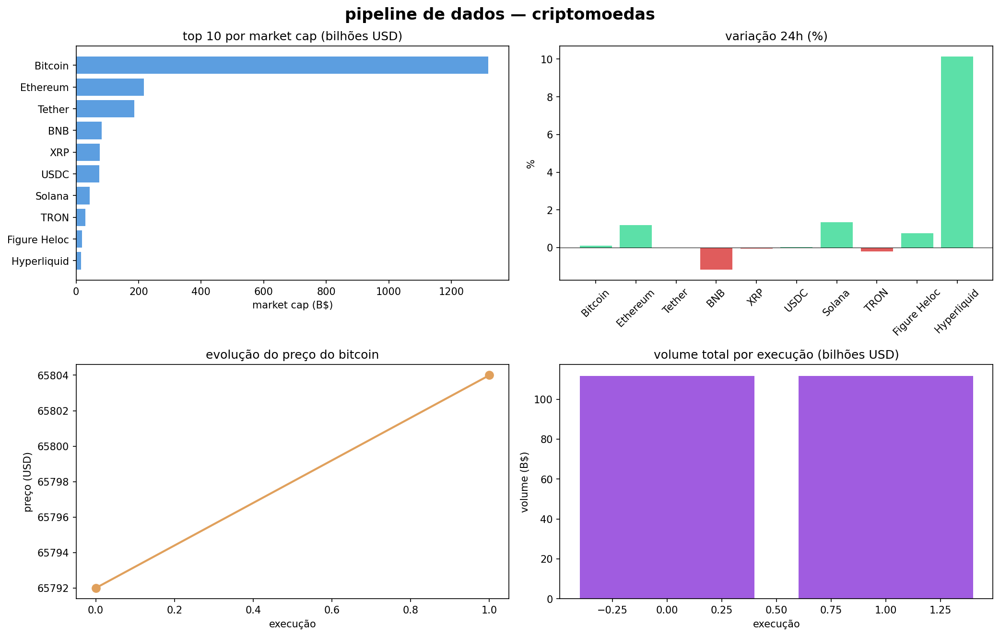

# Pipeline de Dados Automatizado — Criptomoedas

ETL em Python que coleta, limpa e armazena preços de criptomoedas em tempo real, com agendamento automático e logging estruturado. Simula um pipeline de produção que roda periodicamente e acumula histórico.

## O que faz

Três etapas isoladas executadas em sequência:

1. **Coleta** — requisição à API pública CoinGecko, retorna preço, market cap, volume e variação 24h das 20 maiores criptomoedas
2. **Limpeza** — remove nulos, filtra registros inválidos e padroniza casas decimais
3. **Armazenamento** — persiste no SQLite com timestamp de coleta, acumulando histórico a cada execução

## Decisões técnicas

**Logging estruturado** em vez de print — cada etapa registra timestamp, nível de severidade e mensagem. Em produção permite monitoramento, alertas e rastreamento de falhas.

**Try/except por etapa** — falha na coleta aborta o pipeline sem quebrar o processo. Falha isolada não propaga erro.

**SQLite com append** — cada execução adiciona registros sem sobrescrever os anteriores. Após 2 execuções o banco acumulou 40 registros com timestamps distintos, permitindo análise de variação temporal.

**schedule** — agendamento simples sem dependência de cron ou infraestrutura externa. Em produção substituiria por Airflow ou cron job.

## Resultados

- 2 execuções automáticas registradas
- 40 registros acumulados no banco
- Bitcoin: $65.792 → $65.804 entre execuções

## Tecnologias

- Python 3
- requests — coleta via API REST
- pandas — transformação dos dados
- SQLAlchemy + SQLite — armazenamento persistente
- schedule — agendamento de execuções
- logging — monitoramento estruturado
- matplotlib — visualizações

## Como rodar

1. Clique no badge **Open in Colab** acima
2. Vá em `Runtime > Run all`
3. O pipeline roda automaticamente 2 vezes com intervalo de 1 minuto
4. Os dados ficam persistidos em `cripto.db`

## Resultado

